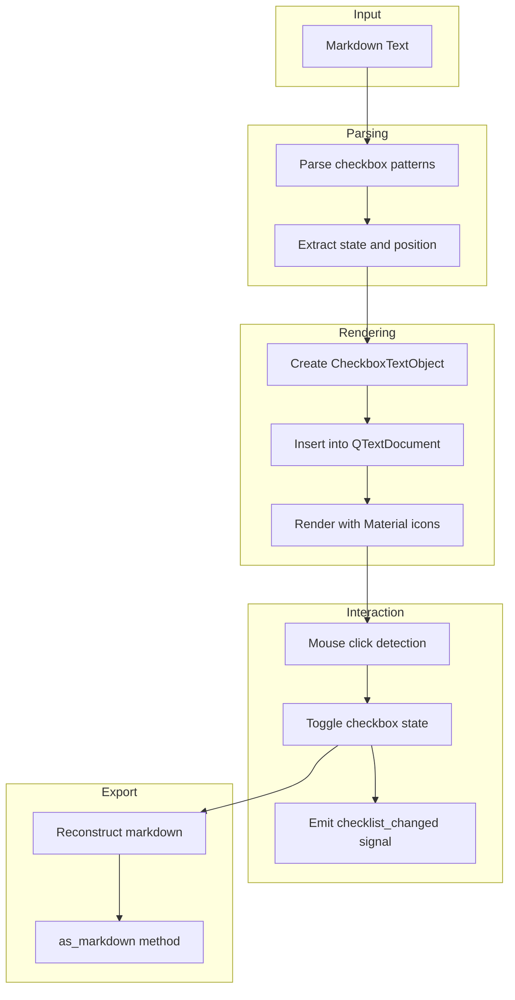
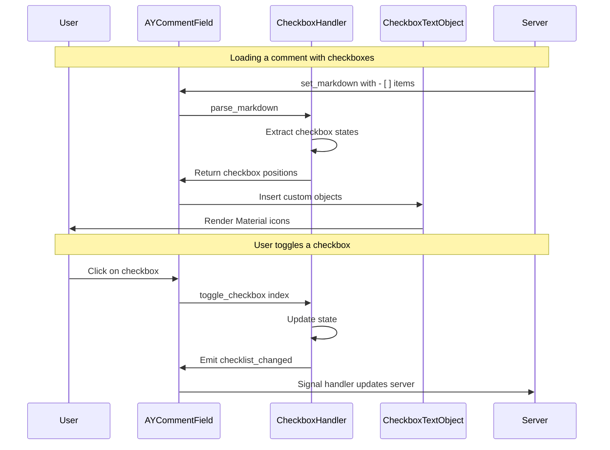

# Markdown Checklist Implementation Plan

## Overview

This document outlines the implementation plan for adding editable, styled checkboxes to [`AYCommentField`](client/ayon_ui_qt/components/comment.py:191). The checkboxes should:

1. Be rendered with Material icons (unchecked: white `radio_button_unchecked`, checked: green `check_circle`)
2. Be interactive even when the field is read-only
3. Emit a `checklist_changed` signal when toggled
4. Support GitHub-flavored markdown syntax for import/export (`- [ ]` / `- [x]`)

## Technical Challenges

### Qt's Built-in Markdown Limitations

Qt's `QTextDocument.setMarkdown()` does support GitHub-flavored markdown (including task lists), but:
- The checkbox styling is limited to the default system checkboxes
- In read-only mode (`QTextEdit.setReadOnly(True)`), checkboxes become non-interactive
- Custom styling of checkboxes rendered within the document is not straightforward

### Proposed Solution: QTextObjectInterface

The most robust approach is to use Qt's **QTextObjectInterface** to embed custom widgets/objects directly into the `QTextDocument`. This allows us to:

1. Parse markdown checkboxes (`- [ ]` / `- [x]`)
2. Replace them with custom inline objects that render Material icons
3. Handle click events on these objects to toggle state
4. Maintain a mapping between document positions and checkbox states

## Architecture



## Implementation Components

### 1. CheckboxTextObject Class

A new class implementing `QTextObjectInterface` to render checkboxes as inline objects.

**File:** [`client/ayon_ui_qt/components/checkbox_text_object.py`](client/ayon_ui_qt/components/checkbox_text_object.py) (new file)

```python
from qtpy.QtCore import QRectF, QSizeF, Qt
from qtpy.QtGui import QPainter, QTextDocument, QTextFormat, QTextObjectInterface
from qtpy.QtWidgets import QTextEdit

try:
    from qtmaterialsymbols import get_icon
except ImportError:
    from ..vendor.qtmaterialsymbols import get_icon


class CheckboxTextObject:
    """Custom text object for rendering checkboxes with Material icons."""

    # Custom format type for checkboxes
    CHECKBOX_FORMAT_TYPE = QTextFormat.ObjectTypes.UserObject + 1

    # Property keys for checkbox data
    CHECKBOX_CHECKED = 1
    CHECKBOX_INDEX = 2

    @staticmethod
    def intrinsicSize(
        doc: QTextDocument,
        posInDocument: int,
        format: QTextFormat,
    ) -> QSizeF:
        """Return the size of the checkbox icon."""
        font = doc.defaultFont()
        size = font.pointSize() * 1.5  # Scale relative to font
        return QSizeF(size, size)

    @staticmethod
    def drawObject(
        painter: QPainter,
        rect: QRectF,
        doc: QTextDocument,
        posInDocument: int,
        format: QTextFormat,
    ) -> None:
        """Draw the checkbox icon."""
        is_checked = format.property(CheckboxTextObject.CHECKBOX_CHECKED)

        if is_checked:
            icon = get_icon("check_circle", color="#4CAF50")  # Green
        else:
            icon = get_icon("radio_button_unchecked", color="#FFFFFF")  # White

        pixmap = icon.pixmap(int(rect.width()), int(rect.height()))
        painter.drawPixmap(rect.topLeft().toPoint(), pixmap)
```

### 2. CheckboxHandler Class

Manages checkbox state, parsing, and interaction.

**File:** [`client/ayon_ui_qt/components/checkbox_handler.py`](client/ayon_ui_qt/components/checkbox_handler.py) (new file)

```python
from dataclasses import dataclass
import re
from typing import List, Tuple

from qtpy.QtCore import QObject, Signal
from qtpy.QtGui import QTextCharFormat, QTextCursor, QTextDocument


@dataclass
class CheckboxItem:
    """Represents a checkbox in the document."""
    index: int
    checked: bool
    text: str
    start_pos: int  # Position in plain text
    end_pos: int    # End position of checkbox line


class CheckboxHandler(QObject):
    """Handles checkbox parsing, rendering, and state management."""

    checklist_changed = Signal()  # Emitted when any checkbox is toggled

    # GitHub-flavored markdown checkbox patterns
    CHECKBOX_PATTERN = re.compile(r'^(\s*[-*+]\s+)\[([xX ])\]\s*(.*)$', re.MULTILINE)

    def __init__(self, parent=None):
        super().__init__(parent)
        self._checkboxes: List[CheckboxItem] = []
        self._document: QTextDocument = None

    def parse_markdown(self, text: str) -> Tuple[str, List[CheckboxItem]]:
        """Parse markdown and extract checkbox information.

        Returns:
            Tuple of (processed text, list of CheckboxItems)
        """
        # Implementation details...
        pass

    def toggle_checkbox(self, index: int) -> None:
        """Toggle a checkbox by its index."""
        if 0 <= index < len(self._checkboxes):
            self._checkboxes[index].checked = not self._checkboxes[index].checked
            self.checklist_changed.emit()

    def to_markdown(self) -> str:
        """Reconstruct markdown with current checkbox states."""
        # Implementation details...
        pass
```

### 3. Modifications to AYCommentField

**File:** [`client/ayon_ui_qt/components/comment.py`](client/ayon_ui_qt/components/comment.py:191)

Key changes to [`AYCommentField`](client/ayon_ui_qt/components/comment.py:191):

1. Add `checklist_changed` signal declaration
2. Instantiate and configure `CheckboxHandler`
3. Override `mousePressEvent()` to detect checkbox clicks (works even in read-only)
4. Modify `set_markdown()` to use the checkbox handler
5. Modify `as_markdown()` to reconstruct checkbox states

```python
class AYCommentField(AYTextEdit):
    """Text field for comment display with markdown support."""

    Variants = QTextEditVariants
    checklist_changed = Signal()  # NEW: Emitted when checkbox state changes

    def __init__(self, ...):
        # ... existing code ...

        # NEW: Initialize checkbox handler
        self._checkbox_handler = CheckboxHandler(self)
        self._checkbox_handler.checklist_changed.connect(
            self.checklist_changed.emit
        )

        # Register custom text object for checkboxes
        self._register_checkbox_handler()
```

### 4. Click Detection Strategy

Since checkboxes need to be clickable even in read-only mode, we leverage the existing `mousePressEvent()` override in [`AYCommentField`](client/ayon_ui_qt/components/comment.py:340):

```python
def mousePressEvent(self, event) -> None:
    """Handle mouse press events to toggle checkboxes and open links."""
    cursor = self.cursorForPosition(event.pos())
    char_format = cursor.charFormat()

    # Check if clicked on a checkbox
    if char_format.objectType() == CheckboxTextObject.CHECKBOX_FORMAT_TYPE:
        index = char_format.property(CheckboxTextObject.CHECKBOX_INDEX)
        self._checkbox_handler.toggle_checkbox(index)
        self._update_checkbox_display(index)
        event.accept()
        return

    # ... existing link handling code ...
```

## Data Flow



## File Changes Summary

| File | Change Type | Description |
|------|-------------|-------------|
| `checkbox_text_object.py` | New | QTextObjectInterface implementation for rendering |
| `checkbox_handler.py` | New | Checkbox state management and parsing |
| `comment.py` | Modify | Add signal, integrate handler, click detection |
| `comment_completion.py` | Modify | Update `parse_markdown_from_web()` to handle checkboxes |

## Implementation Steps

1. **Create CheckboxTextObject class** - Implement the rendering logic for checkbox icons
2. **Create CheckboxHandler class** - Handle parsing, state management, and markdown export
3. **Register custom object handler** - Connect `QTextObjectInterface` to `QTextDocument`
4. **Modify AYCommentField.set_markdown()** - Parse and render checkboxes
5. **Modify AYCommentField.mousePressEvent()** - Add checkbox click detection
6. **Modify AYCommentField.as_markdown()** - Export with updated checkbox states
7. **Add checklist_changed signal** - Wire up the signal emission
8. **Testing** - Verify roundtrip and visual appearance

## Alternative Approaches Considered

### 1. CSS Styling of Native Markdown Checkboxes
- **Pros:** Simpler implementation
- **Cons:** Limited control over appearance, doesn't work in read-only mode

### 2. HTML Rendering with Custom Checkbox Elements
- **Pros:** Full styling control
- **Cons:** Requires switching to HTML mode, may break other markdown features

### 3. Overlay Widgets
- **Pros:** Full widget functionality
- **Cons:** Complex positioning, synchronization issues with text scrolling

## Questions/Considerations

1. **Checkbox list detection:** Should we only render checkboxes in GitHub-style task lists (`- [ ]`), or also support other formats?
   - **Recommendation:** Start with GitHub-style only for compatibility

2. **Checkbox indentation:** Should nested checklists be supported?
   - **Recommendation:** Support flat lists initially, add nesting if needed

3. **Visual feedback:** Should there be hover effects on checkboxes?
   - **Recommendation:** Yes, change cursor to pointer on hover (already partially implemented for links)

4. **Undo/Redo:** Should checkbox toggles be undoable?
   - **Recommendation:** Yes, integrate with `QTextDocument`'s undo stack if possible

## Testing Plan

1. **Unit tests for CheckboxHandler:**
   - Parse various markdown formats
   - Toggle state correctly
   - Export markdown correctly

2. **Visual tests:**
   - Checkboxes render with correct icons
   - Icon colors are correct (white unchecked, green checked)
   - Icon size scales with font

3. **Interaction tests:**
   - Click toggles checkbox in editable mode
   - Click toggles checkbox in read-only mode
   - Signal is emitted on toggle

4. **Roundtrip tests:**
   - Markdown -> display -> markdown preserves checkbox states
   - Mixed content (text + checkboxes + links) works correctly
